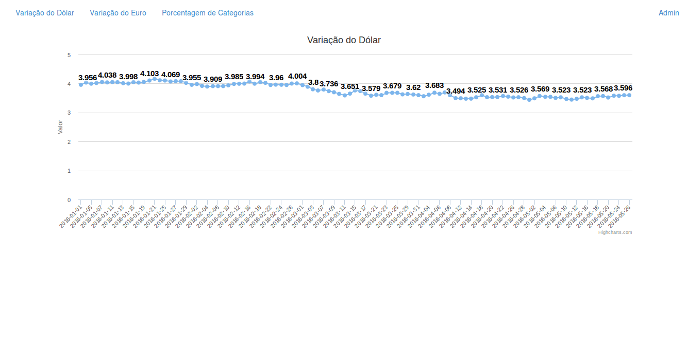
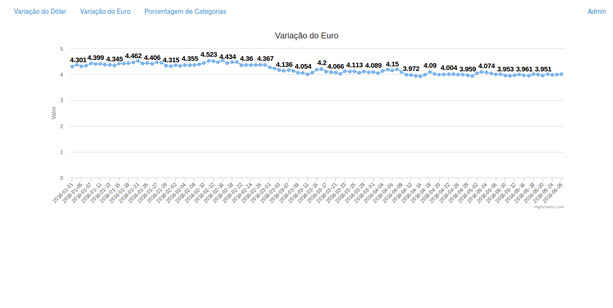
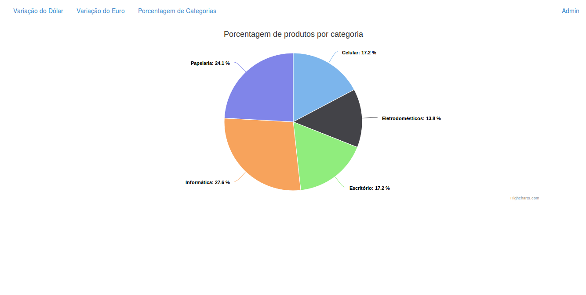

# Highcharts and Django

Highcharts and Django test examples.

```bash
git clone https://github.com/rg3915/highcharts.git
cd highcharts
source setup.sh
```

## Tutorial

### Modelo

```python
# models.py
from django.db import models


class Dollar(models.Model):
    date = models.DateField('data')
    value = models.DecimalField('valor', max_digits=4, decimal_places=3)


class Euro(models.Model):
    date = models.DateField('data')
    value = models.DecimalField('valor', max_digits=4, decimal_places=3)


class Category(models.Model):
    category = models.CharField('categoria', max_length=50, unique=True)


class Product(models.Model):
    category = models.ForeignKey('Category', verbose_name='categoria')
    product = models.CharField('Produto', max_length=60, unique=True)
    price = models.DecimalField('Preço', max_digits=6, decimal_places=2)
```

### Importando os dados de um CSV

**Variação do dólar**

http://www.dolarhoje.net.br/dolar-comercial.php


```python
# dollar.csv
date,value
1/1/2016,3.956
4/1/2016,4.033
5/1/2016,3.994
6/1/2016,4.017
7/1/2016,4.052
8/1/2016,4.038
11/1/2016,4.049
...
```

**Variação do euro**

http://br.investing.com/currencies/eur-brl-historical-data

Veja os CSV:

[euro.csv](highcharts/fix/euro.csv)

[category.csv](highcharts/fix/category.csv)

[product.csv](highcharts/fix/product.csv)

Importando os dados via shell

```bash
python manage.py shell < highcharts/shell/shell_dollar.py
```

Eis o código:

```python
# shell_dollar.py
import csv
import datetime as dt
from highcharts.core.models import Euro

euro_list = []

''' Lendo os dados de euro.csv '''
with open('highcharts/fix/euro.csv', 'r') as f:
    r = csv.DictReader(f)
    for dct in r:
        d = dct['date']
        # Convert '%d/%m/%Y' to '%Y-%m-%d'.
        d = dt.datetime.strptime(d, '%d/%m/%Y').strftime('%Y-%m-%d')
        euro_list.append((d, dct['value']))
    f.close()


obj = [Euro(date=val[0], value=val[1]) for val in euro_list]
Euro.objects.bulk_create(obj)

# done
```

Vamos criar um arquivo chamado `graphics.py`.

```bash
touch graphics.py
```

Este é o seu código:

```python
# graphics.py
import json
from django.db.models import Count
from django.core.serializers.json import DjangoJSONEncoder
from django.http import HttpResponse
from .models import Dollar, Euro, Product


def dollar_json(request):
    data = Dollar.objects.values('date', 'value')
    lista = [{'dia': i['date'], 'valor': float(i['value'])} for i in data]
    resp = json.dumps(lista, cls=DjangoJSONEncoder)
    return HttpResponse(resp)


def euro_json(request):
    data = Euro.objects.values('date', 'value')
    lista = [{'dia': i['date'], 'valor': float(i['value'])} for i in data]
    resp = json.dumps(lista, cls=DjangoJSONEncoder)
    return HttpResponse(resp)


def product_json(request):
    ''' Porcentagem de produtos por categoria '''
    data = Product.objects.values('category')\
        .annotate(value=Count('category'))\
        .order_by('category').values('category', 'category__category', 'value')
    total = Product.objects.all().count()
    ''' Podemos reescrever o dicionário com nosso próprio nome de campos. '''
    lista = [{'categoria': item['category__category'],
              'porcentagem': float((item['value'] / total) * 100)} for item in data]
    s = json.dumps(lista, cls=DjangoJSONEncoder)
    return HttpResponse(s)
```

```python
# urls.py
from django.conf.urls import include, url
from django.contrib import admin

urlpatterns = [
    url(r'', include('highcharts.core.urls', namespace='core')),
    url(r'^admin/', include(admin.site.urls)),
]
```

Crie também um `core/urls.py`.

```bash
touch core/urls.py
```

```python
# core/urls.py
from django.conf.urls import url
from highcharts.core.graphics import dollar_json, euro_json, product_json
from highcharts.core import views as v

urlpatterns = [
    url(r'^$', v.home, name='home'),
    url(r'^dollar-graphic/$', v.dollar_graphic, name='dollar-graphic'),
    url(r'^euro-graphic/$', v.euro_graphic, name='euro-graphic'),
    url(r'^product-graphic/$', v.product_graphic, name='product-graphic'),
    url(r'^dollar_json/$', dollar_json),
    url(r'^euro_json/$', euro_json),
    url(r'^product_json/$', product_json),
]
```

View para o Template.

```python
# views.py
from django.shortcuts import render


def home(request):
    return render(request, 'index.html')


def dollar_graphic(request):
    return render(request, 'dollar_graphic.html')


def euro_graphic(request):
    return render(request, 'euro_graphic.html')


def product_graphic(request):
    return render(request, 'product_graphic.html')
```

Dentro da pasta `highcharts/core/` crie a pasta `templates`.

```bash
mkdir templates
touch templates/base.html
touch templates/dollar_graphic.html
```

```html
# base.html

<html>
<head>
  <meta charset="UTF-8">
  <title>Highcharts</title>

  <!-- Favicon -->
  <link rel="shortcut icon" href="">

  <!-- Bootstrap -->
  <link rel="stylesheet" href="">

  <!-- jQuery -->
  <!-- <script src="https://code.jquery.com/jquery-2.1.4.min.js"></script> -->
  <script src=""></script>
  <!-- HighCharts JS -->
  <!-- <script src="http://code.highcharts.com/highcharts.js"></script> -->
  <script src=""></script>
  <!-- Bootstrap JS -->
  <script src=""></script>

  <style type="text/css">
    /* Move down content because we have a fixed navbar that is 50px tall */
    body {
      padding-top: 60px;
      padding-bottom: 40px;
      /*color: #5a5a5a;*/
    }
  </style>

</head>
<body>
  
  <div class="container">
    
    
  </div>
</body>
</html>
```

```html
# dollar_graphic.html




  <div id="dollar-chart"></div>



  <script src=""></script>

```

Crie a pasta `static/js`.

```bash
mkdir -p static/js
touch static/js/dollar_graphic.js
```

```js
# dollar_graphic.js
$(function () {
    var url = "/dollar_json/";

    $.getJSON(url, function(res){
        console.log(res);
        /* Transformando o dicionário em lista.
           Com o comando map eu coloco uma lista dentro da outra,
           necessário para este tipo de gráfico. */
        var data = res.map(function (v) {
            return [v.dia, v.valor]
        });

        console.log(data);

        $('#dollar-chart').highcharts({
            chart: {
                type: 'line'
            },
            title: {
                text: 'Variação do Dólar'
            },
            xAxis: {
                type: 'category'
            },
            yAxis: {
                min: 0,
                title: {
                    text: 'Valor'
                },
                plotOptions: {
                    line: {
                        dataLabels: {
                            enabled: true
                        },
                    }
                },
            },
            legend: {
                enabled: false
            },
            series: [{
                data: data,
                dataLabels: {
                    enabled: true,
                    align: 'center',
                    style: {
                        fontSize: '15px'
                    }
                }
            }],
        });
    });
});
```

Veja o resultado:



Veja também:

[euro_graphic.js](static/js/euro_graphic.js)



[product_graphic.js](static/js/product_graphic.js)




# Projeto antigo

Veja o [projeto antigo](old.md).